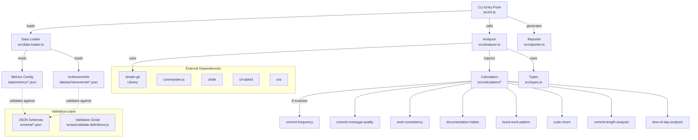
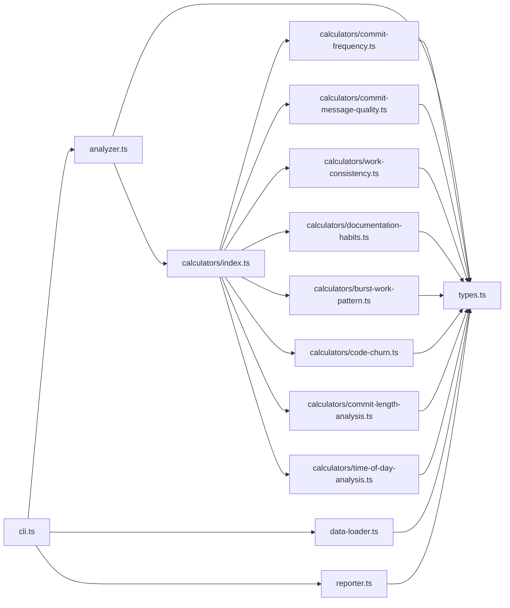
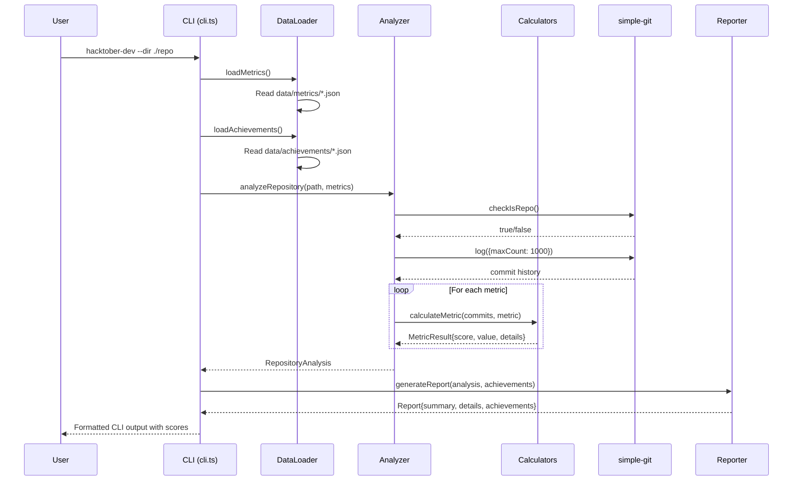
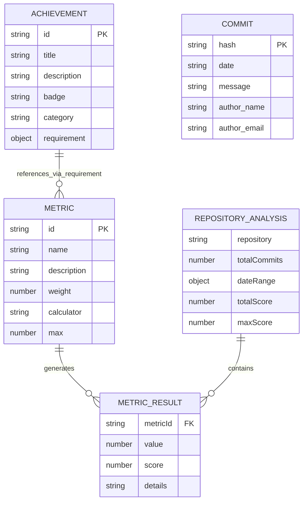

# HACKTOBER-DEV — Code-First Architecture Report

## 1. What the Code Says This Is

**Purpose**: A command-line interface tool that analyzes Git repositories to calculate a "hackiness score" (0-100) based on developer habits including commit frequency, message quality, work consistency, documentation patterns, and coding behaviors. The tool provides gamified feedback through achievements and detailed metrics to help developers understand their coding patterns.

**Top Signals**:
- **Languages**: TypeScript (14 files, ~800 LoC), JSON (25 config files), Markdown (89 docs)
- **Total Files**: 158 files, ~21,868 lines across all file types
- **Primary Framework**: Node.js CLI application using Commander.js
- **Package Manager**: npm with lockfile v3

**Evidence**:
- `package.json:4-5` - "CLI tool to measure your hackiness level through comprehensive Git repository analysis"
- `src/cli.ts:11-13` - Main CLI entry point with Commander.js setup
- `src/analyzer.ts:6-25` - Core repository analysis using simple-git library
- `data/metrics/*.json` - 8 metric definitions for hackiness calculation
- `data/achievements/*.json` - 9 achievement definitions for gamification

## 2. Architecture at a Glance



**Trust Boundaries**: Clear separation between data loading (file system), analysis (git operations), and presentation (CLI output). No network operations or external API calls.

**Coupling Hotspots**: 
- All calculators depend on `types.ts:Commit` interface
- `analyzer.ts` has high fan-out to all calculator modules
- Data files are tightly coupled to JSON schema validation

## 3. Module & Dependency Graph (Internal)



**High Fan-in Modules**:
1. `types.ts` - imported by 11 modules (central type definitions)
2. `calculators/index.ts` - aggregates 8 calculator modules

**High Fan-out Modules**:
1. `analyzer.ts` - imports from types, calculators, and external git library
2. `cli.ts` - orchestrates analyzer, data-loader, and reporter

**No Cycles Detected**: Clean dependency hierarchy with types at the base, calculators in the middle, and orchestration at the top.

## 4. Typical Execution Flow



## 5. API Surface

### CLI Commands
| Command | Options | Handler | File |
|---------|---------|---------|------|
| `hacktober-dev` | `-d, --dir <path>` | Default action | `src/cli.ts:16-52` |
| | `-v, --verbose` | Show detailed analysis | |
| | `--submit` | Submit to leaderboard (placeholder) | |
| | `--test` | Run with sample data | |

### Internal APIs
| Module | Function | Purpose | File:Lines |
|--------|----------|---------|------------|
| analyzer | `analyzeRepository()` | Main analysis orchestration | `src/analyzer.ts:6-61` |
| data-loader | `loadMetrics()` | Load metric definitions | `src/data-loader.ts:3-15` |
| data-loader | `loadAchievements()` | Load achievement definitions | `src/data-loader.ts:17-29` |
| reporter | `generateReport()` | Format analysis results | `src/reporter.ts:5-40` |

### Calculator Functions (8 modules)
All calculators follow pattern: `calculate*Pattern*(commits: Commit[]): number`
- Located in `src/calculators/*.ts`
- Return normalized scores 0-20 (or metric-specific max)
- Pure functions with no side effects

## 6. Data Model



**Real Entities from Code**:
- `Metric` interface: `src/types.ts:8-15` - Configuration for hackiness measurements
- `Achievement` interface: `src/types.ts:17-26` - Gamification rewards
- `Commit` interface: `src/types.ts:2-7` - Git commit data structure
- `MetricResult` interface: `src/types.ts:28-33` - Calculated metric outcomes
- `RepositoryAnalysis` interface: `src/types.ts:35-44` - Complete analysis results

## 7. Configuration & Environments

### Required Environment Variables
**None** - The application runs entirely from local file system and git repository data.

### Configuration Files
| File | Purpose | Format |
|------|---------|--------|
| `data/metrics/*.json` | Metric definitions (8 files) | JSON validated against `schema/hack-level.schema.json` |
| `data/achievements/*.json` | Achievement definitions (9 files) | JSON with requirement thresholds |
| `tsconfig.json` | TypeScript compilation | ES2020 target, CommonJS modules |
| `package.json` | Dependencies and scripts | Node.js >=18 required |

### Build Configuration
- **Target**: ES2020 with CommonJS modules (`tsconfig.json:3-4`)
- **Output**: `dist/` directory (`tsconfig.json:5`)
- **Entry**: `src/cli.ts` compiled to `dist/cli.js` (`package.json:5`)

### Ports and URLs
**None** - Pure CLI application with no network services.

## 8. Build • Run • Test • Deploy

### Build Commands
```bash
# Compile TypeScript to JavaScript
npm run build  # -> tsc

# Development with hot reload
npm run dev    # -> ts-node-dev --respawn --transpile-only src/cli.ts
```

### Run Commands
```bash
# Production (after build)
npm start                    # -> node dist/cli.js
hacktober-dev               # -> dist/cli.js (via bin)

# Development
npm run dev                 # -> ts-node-dev src/cli.ts

# Testing mode
npm test                    # -> node dist/cli.js --test
```

### Validation
```bash
npm run validate            # -> node scripts/validate-definitions.js
```
Validates all JSON files in `data/` against schemas in `schema/` using AJV.

### CI/CD Pipeline
**GitHub Actions** (`.github/workflows/`):

1. **CI Workflow** (`ci.yml`):
   - Triggers: Push/PR to main branch
   - Steps: Checkout → Setup Node.js 20.x → Install → Build → Validate
   - No tests (test files don't exist)

2. **Publish Workflow** (`publish.yml`):
   - Trigger: GitHub release published
   - Steps: Build → Validate → Publish to NPM
   - Requires `NPM_TOKEN` secret

### Docker/Containerization
**None** - No Dockerfile or container configuration found.

## 9. Quality, Tests, and Security Notes

### Test Coverage
**❌ CRITICAL ISSUE**: No test files found in codebase
- Search for `*.test.ts`, `*.spec.ts` returned empty
- `package.json:15` has test script but runs CLI with `--test` flag (not actual tests)
- No testing framework dependencies (Jest, Mocha, etc.)

### Code Quality Tools
- **TypeScript**: Strict mode enabled (`tsconfig.json:7`)
- **Validation**: JSON schema validation with AJV (`scripts/validate-definitions.js`)
- **Linting**: No ESLint or Prettier configuration found
- **Type Checking**: Full TypeScript coverage for source files

### Security Assessment
**✅ GOOD**: 
- No hardcoded secrets found (regex search for passwords/tokens returned empty)
- No network operations or external API calls
- `npm audit` reports 0 vulnerabilities
- Input validation through JSON schemas

**⚠️ MODERATE RISKS**:
- File system operations without explicit path validation (`data-loader.ts`)
- Git repository access could be exploited with malicious repos
- No input sanitization for directory paths in CLI options

### Dependency Security
**External Dependencies** (5 production):
- `commander@^11.1.0` - CLI framework (well-maintained)
- `chalk@^4.1.2` - Terminal colors (stable, widely used)
- `simple-git@^3.20.0` - Git operations (active maintenance)
- `cli-table3@^0.6.3` - Table formatting (stable)
- `ora@^5.4.1` - Loading spinners (stable)

**Development Dependencies** (5):
- All TypeScript and validation related
- No known security issues

## 10. Contradictions & Unknowns

### Code vs Documentation Mismatches
1. **README Claims vs Implementation**:
   - README mentions "Submit to leaderboard" feature (`README.md:45`) 
   - Code shows placeholder: `console.log(chalk.yellow('\n🚀 Feature coming soon: Submit to leaderboard!'))` (`src/cli.ts:44`)

2. **Test Claims**:
   - `package.json:15` suggests testing capability with `npm test`
   - Actual implementation runs CLI with `--test` flag, not unit tests
   - No test files or testing framework found

3. **Schema Validation Mismatch**:
   - Validation script references `levels/`, `profiles/profile-levels/`, `habits/` directories (`scripts/validate-definitions.js:54-56`)
   - Actual data structure uses `data/metrics/` and `data/achievements/`
   - Validation script appears to be from different project version

### Open Questions
1. **How is the `--test` flag supposed to work?** 
   - Code doesn't show test data handling
   - Verify: Check if test data exists or if flag is implemented

2. **Are the JSON schemas actually used?**
   - Schemas exist but validation script targets wrong directories
   - Verify: Run validation script to see if it works

3. **What's the intended deployment model?**
   - NPM package setup suggests public distribution
   - Verify: Check if package is published on NPM registry

## 11. Appendix

### Full Dependency List (Production)
```json
{
  "commander": "^11.1.0",
  "chalk": "^4.1.2", 
  "simple-git": "^3.20.0",
  "cli-table3": "^0.6.3",
  "ora": "^5.4.1"
}
```

### Directory Structure (Top-level)
```
├── .github/          # CI/CD workflows and issue templates
├── data/             # Metrics and achievements configuration (25 JSON files)
├── docs/             # Documentation and analysis reports
├── schema/           # JSON validation schemas (3 files)
├── scripts/          # Build and validation utilities
├── src/              # TypeScript source code (14 files)
├── package.json      # NPM configuration and dependencies
├── tsconfig.json     # TypeScript compiler configuration
└── README.md         # Project documentation
```

### Generation Parameters
- **Analysis Date**: 2025-10-06
- **Commit Hash**: 4c41de8
- **Branch**: main
- **Tool Version**: claude-4-sonnet@analysis-agent
- **Total Files Analyzed**: 158 files (~21,868 lines)
- **Analysis Duration**: Comprehensive static analysis with dependency audit